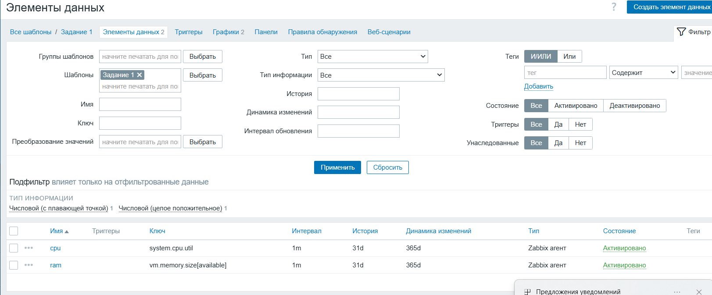
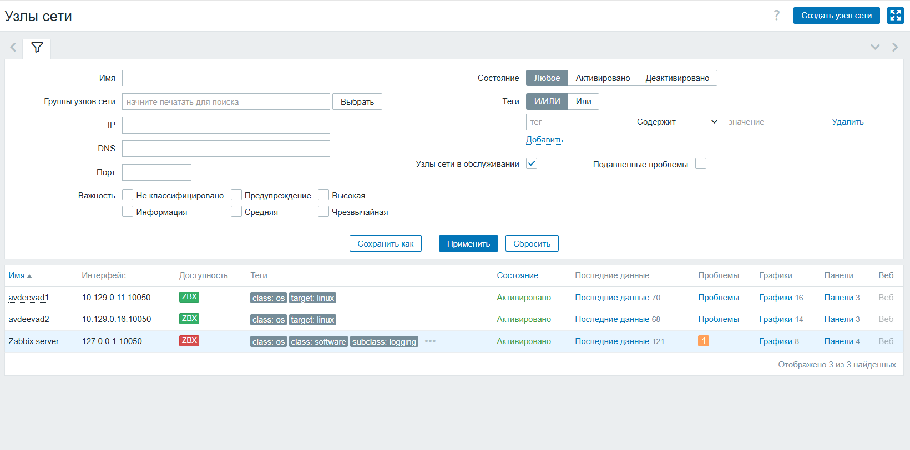
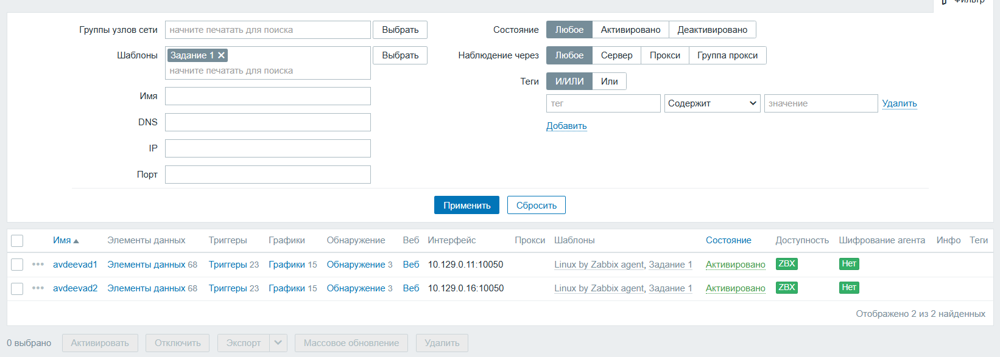
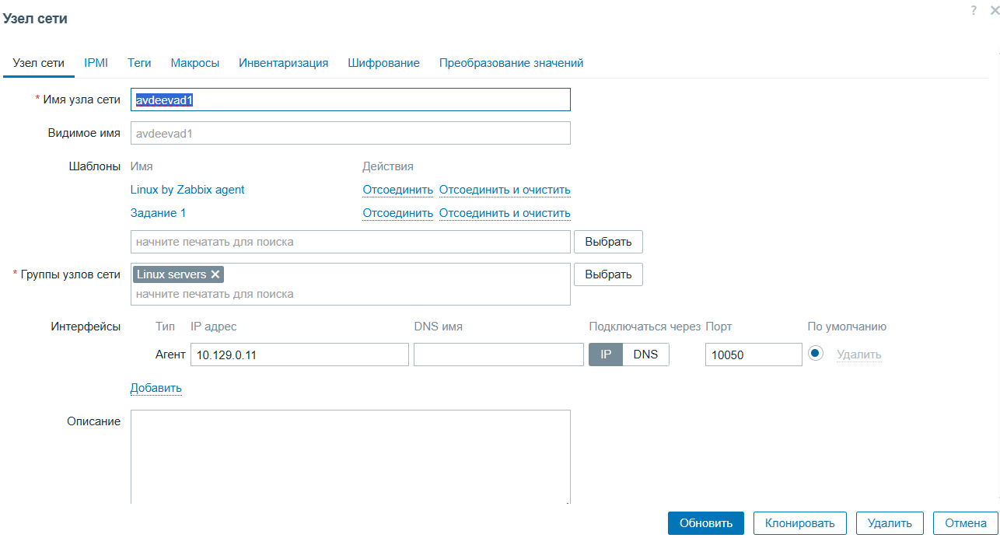
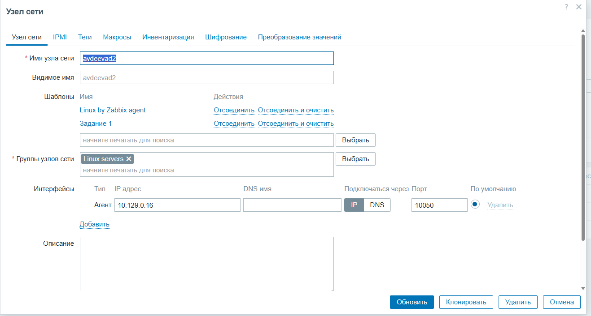
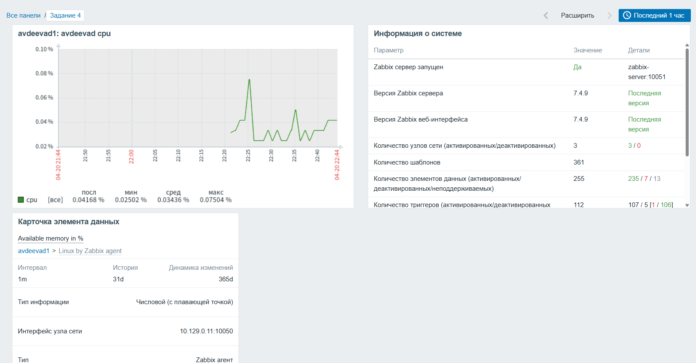

# Настройка Zabbix avdeevad

## 1. Создайте свой шаблон, в котором будут элементы данных, мониторящие загрузку CPU и RAM хоста.

В веб-интерфейсе Zabbix переходим в `Configuration` → `Templates` → `Create template`.

*Имя шаблона* – `Задание_1`.

## 2. Добавьте в Zabbix два хоста и задайте им имена <фамилия и инициалы-1> и <фамилия и инициалы-2>. Например: ivanovii-1 и ivanovii-2.

## 3. Привяжите созданный шаблон к двум хостам. Также привяжите к обоим хостам шаблон Linux by Zabbix Agent.

## 4. Создание графика

Добавляем график, выбираем созданные элементы данных.

